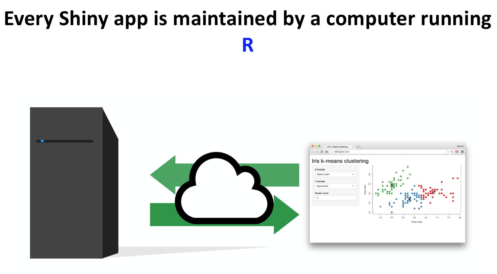
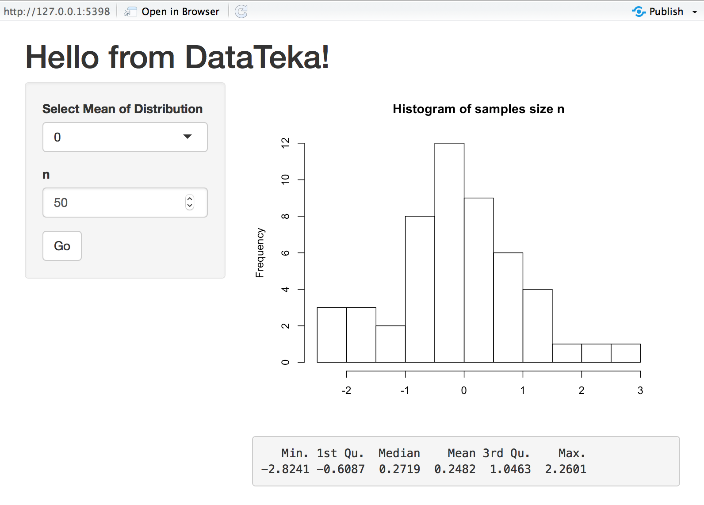

class: inverse, center, middle

#Get Started 🤫😴


---
class: inverse, middle

##Data Democracy

<span style="color:red">Data Democracies</span> is still an unspecific phenomena, but there are established  agreements that are included into this concept:

-	Everybody can access information in any digital format.

-	Data Quality is a must!

-	Nonspecialists should be able to access and analyse data without requiring outside help.

-	Open source analytic programs (for example R, Python, NoSQL) and dashboards play a vital part in empowering nontechnical people in a Data Democracy.

-	Open approach to teaching and learning is a valuable element in enabling people to become aware of the potential embodied within data democracy.

-	share your scripts and data 


---
```{r setup, include=FALSE}
options(htmltools.dir.version = FALSE)
```
background-image: url(https://upload.wikimedia.org/wikipedia/commons/c/c1/Rlogo.png)
???

Image credit: [Wikimedia Commons](https://commons.wikimedia.org/wiki/File:Rlogo.png)

---
class: inverse, middle

##Before there was R, there was S! 🤠

**R** is a dialect of **S** language that was developed in 1976 by *Rick Becker* and *John Chambers* at the  Bell Laboratories.

*Rick Becker* gave an excellent keynote talk *"Forty Years of S"* at UseR!2016 conference:   
[Rick Becker @ UseR!2016](http://blog.revolutionanalytics.com/2016/07/rick-becker-s-talk.html) where he talked about development of **S** language that gives explanations for many characteristics of **R** as we know it, including "<-" assignment operator.

1993 Bell Labs gave StatSci (later Insightful Corp.) an exclusive license to develop and sell the **S** language. Insightful sold its implementation of the **S** language under the product name **S-PLUS**.

You can read more about the [history of S, R, and S-PLUS](https://www.whoishostingthis.com/resources/s-plus/)

---
class: inverse, middle

## then, R was born 😇🎶
In early nineties at the University of Aucklandn in the Department of Statistics **R** was created by *Ross Ihaka* and *Robert Gentleman*.

They used [GNU General Public License](http://www.gnu.org/licenses/gpl-2.0.html) to make R open source free software. 

**R**oss Ihaka and **R**obert Gentleman. *R: A language for data analysis and graphics.* Journal of Computational and Graphical Statistics, 5(3):299–314, 1996

Currently **R** is developed by the **R Development Core Team**, of which *John Chambers* is a member.
---

class: inverse, middle

#What is R? 💡📈📑📊🤩

- **Most popular data analysis software**
-- used by some of the hottest tech companies like: google, Facebook, Amazon, LinkedIn etc. 

- **Comprehensive public domain language for data analysis**
-- with no licensing costs associated with it

- **Most powerful statistical programming language**
-- flexible: enables easy experimentation and exploration, which improves data analysis

- **Creates beautiful and unique data visualisation**
-- used by Wasington Post, New York Times, twitter...

- **Tool behind reporting automated modern data analyses in a reproducible manner** 
-- making an analysis more useful to others

- **Independent of any platform**
-- R is universally applicable and simple to integrate into existing IT structures.

You can download R for free from: <https://cran.r-project.org/>

and RStudio, a free and open-source integrated development environment (IDE) for R <https://www.rstudio.com/>
---
class: inverse, middle

## R Community

.pull-left[

]

.pull-right[
###<span style="color:#00B2EE">“The R community is one of R’s best features!” 
####[Revolutions](https://blog.revolutionanalytics.com/) Daily news about using open source R.</span>

####<span style="color:#00B2EE">Open community::</span> collaborative, community activity with a mission to create, maintain, and promote schemes for structured data on the Internet, on web pages, in email messages, and beyond. 
]

---
class: inverse, middle

## Support and collaboration 


Supported by the **R Foundation for Statistical Computing** and with the strong and open engagement of developers and users from all walks of background from science to commerce it is hard to envisage that any commercial corporation will be able to develop sustainable business models with the same innovative drive and power as **R community**.

The collaboration amongst statisticians and other scientist who are engaged with statistical computing and growing interest and engagement of large companies creates altruistic **R community** which generates the force within which R is conquering the field of data analytics. As a result it creates a more powerful R resource and becomes more usable and attractive to Data scientists and analysists.

---
class: inverse, middle

##Reproducability: Why should we care? 

.pull-left[
I) Academic research:
- Verify results 
- Advance research

II) Businesses:
- Production Code
- Reliability
- Reusability
- Collaboration
- Regulation

III) Social communities:
- Transparency
- Colaboration
- Enhance learning
]

.pull-right[


[How Bright Promise in Cancer Testing Fell Apart](https://www.nytimes.com/2011/07/08/health/research/08genes.html)
]

---

class: inverse, middle
### This presentation available from: 

####<https://tanjakec.github.io/DataDemocrcyKlikR/DataDemocrcyKlikR.html>

### To download go to GitHub repo: 

####<https://github.com/TanjaKec/DataDemocrcyKlikR>


---
class: inverse, middle

##Write R Code

To start using **R** you need to:

1) If you haven't already: install [R](https://cran.r-project.org/) [(and RStudio)](https://www.rstudio.com/products/rstudio/download/#download)

2) Launch it and set your working directory: letting R know where to find all of your files.

3) Start writing **R** code!

**Tip**💡:
- When start working on a new R code/R Project in [RStudio IDE](https://support.rstudio.com/hc/en-us/sections/200107586-Using-the-RStudio-IDE) use 
***File -> New Project*** 
This way your working directory would be set up when you start a new project and it will save all your files in it. Next time you open your project it would set project's directory as a working directory... It would help you with so much [more](https://support.rstudio.com/hc/en-us/articles/200526207-Using-Projects). 

### Let us have a quick lesson 💻🔮💡😇

<https://datateka.shinyapps.io/klikr_Lesson1>
---

class: center, middle

##[RStudio IDE Cheatsheet](https://www.rstudio.com/wp-content/uploads/2016/01/rstudio-IDE-cheatsheet.pdf)

```{r, out.width = "500px", echo=FALSE}
knitr::include_graphics("images/RStudio.png")
```

***Top Left:*** Code Editor;
--

***Bottom Left:*** R Console;
--

***Top Right:*** Environment
--

***Bottom Right:*** Plots and Files
---
class: inverse, center, middle

#Let's Shiny with R 
## 🌞😎🤩
---
##What is Shiny?

**Shiny** is a package from [RStudio](https://www.rstudio.com) that can be used to build interactive web apps with `R`. 

You can host standalone apps on a webpage or embed them in [R Markdown](https://rmarkdown.rstudio.com) documents or build [dashboards](http://rstudio.github.io/shinydashboard/. You can also extend your Shiny apps with [CSS themes](http://rstudio.github.io/shinythemes/), [htmlwidgets](http://www.htmlwidgets.org), and [JavaScript actions](https://github.com/daattali/shinyjs/blob/master/README.md).

Shiny combines the computational power of R with the interactivity of the modern web.

Shiny apps are easy to write. No web development skills are required.
---

##How does it work?
```{r, out.width = "700px", echo=FALSE, fig.align = 'center'}

```
---

##There are two elements
```{r, out.width = "700px", echo=FALSE, fig.align = 'center'}
knitr::include_graphics("images/Shiny2.png")
```

---
##App Template
```{r, out.width = "700px", echo=FALSE, fig.align = 'center'}
knitr::include_graphics("images/Shiny3.png")
```
---

##Run & Stop
```{r, out.width = "700px", echo=FALSE, fig.align = 'center'}

```

---
##Adding elements
### as arguments to `fluidPage()`
```{r, out.width = "700px", echo=FALSE, fig.align = 'center'}

```

---
##UI: Inputs & Outputs
```{r, out.width = "700px", echo=FALSE, fig.align = 'center'}

```
---

##Adding elements *as arguments to `fluidPage()`*
```{r, out.width = "500px", echo=FALSE, fig.align = 'center'}
knitr::include_graphics("images/Shiny5.1.png")
```
###Create an input with an input function
```{r, out.width = "700px", echo=FALSE, fig.align = 'center'}

```
---

###Create an input with an input function
.pull-left[
**code**
```{r, out.width = "700px", echo=FALSE, fig.align = 'center'}

```
]

.pull-right[
**app**
```{r, out.width = "900px", echo=FALSE, fig.align = 'center'}

```
]
---

##Input Objects
```{r, out.width = "700px", echo=FALSE, fig.align = 'center'}

```
---

##Syntax
```{r, out.width = "1000px", echo=FALSE, fig.align = 'center'}
knitr::include_graphics("images/Shiny7.png")
```

<https://shiny.rstudio.com/reference/shiny/latest/selectInput.html>
---

##Output Objects
```{r, out.width = "1000px", echo=FALSE, fig.align = 'center'}
knitr::include_graphics("images/Shiny8.png")
```
---

###Output: plot 
```{r, out.width = "500px", echo=FALSE, fig.align = 'center'}

```
---

###Remember 💡 
```{r, out.width = "700px", echo=FALSE, fig.align = 'center'}

```
---

###<span style="color:red">3 Rules</span> to write the server function 😎 
```{r, out.width = "750px", echo=FALSE, fig.align = 'center'}
knitr::include_graphics("images/Shiny12.png")
```
---

###You can <span style="color:red">render*()</span> different types of output you wish to make.
```{r, out.width = "750px", echo=FALSE, fig.align = 'center'}

```
---

###<span style="color:red">render*()</span>
```{r, out.width = "750px", echo=FALSE, fig.align = 'center'}

```
---

###Code
```{r, out.width = "400px", echo=FALSE, fig.align = 'center'}

```
---

###The App
```{r, out.width = "700px", echo=FALSE, fig.align = 'center'}

```
<https://datateka.shinyapps.io/How2Shine/>
---

class: inverse, center, middle

#Let's Look at the portal: 
#[Open Data SR](https://data.gov.rs/sr/datasets/) 
## 📑📊📈📉
---

class: inverse, middle

#Example: [Подаци о саобраћајним незгодама за територију Града Београда](https://data.gov.rs/sr/datasets/podatsi-o-saobratshajnim-nezgodama-za-teritoriju-grada-beograda/)

##[Подаци о саобраћајним незгодама до 28.02.2019. године за територију Града Београда](https://data.gov.rs/sr/datasets/r/7a10c1d4-3707-4c5a-93ca-b8e7baf77303) 

### Note 💡: You should open and `File -> Save As...` data as a `csv` file!
---
class: inverse, center, middle

# Access the RProject with the App
Go to Tanja's GitHub and download `OpenDataPlay` repo by clicking on the green button `Clone or Download::Download ZIP`.

<https://github.com/TanjaKec/OpenDataPlay>

```{r, out.width = "500px", echo=FALSE, fig.align = 'center'}

```

---
# What is in the repo?

After unzipping the downloaded file you should have the following in your directory, ie folder:

```{r, out.width = "600px", echo=FALSE, fig.align = 'center'}
knitr::include_graphics("images/GitHub2.png")
```
---
# How does it look like?

- How many Input and Output Objects are there?

- What does it do?

```{r, out.width = "700px", echo=FALSE, fig.align = 'center'}
knitr::include_graphics("images/TrafficAccApp.png")
```

---
# Let's open the app code

Open the project with the App by clicking on `OpenDataPlay.Rproj` file.
In the bottom left window click on `app.R` file.

```{r, out.width = "700px", echo=FALSE, fig.align = 'center'}

```
---
# app.R

The code has two parts:

1) **global code**

- uploading the packages; accessing and tailoring data 

2) **app code**

- remember app template! 🤔💡: user interface; server; running the app

We can see the app in action ☀️😎 at <https://tatjana.shinyapps.io/TrafficAccidents/>

---

class: inverse, center, middle
##Do the Cosmo Dance?! 🤪🎵🎶
```{r, out.width = "500px", echo=FALSE}
knitr::include_graphics("images/Cosmo_Dance.gif")
```
---
class: inverse, middle
###Let's discuss the good and bad points

Serbia
<https://data.gov.rs/sr/>

Manchester, UK

- Community:
<https://www.opendatamanchester.org.uk/>

- Government
<http://open.manchester.gov.uk/>

San Francisco, USA:

<https://datasf.org/opendata/>

good practice:
<https://data.sfgov.org/browse?category=Health+and+Social+Services>

Play: 
[Brazil's House of Deputies Reimbursements](https://www.kaggle.com/epattaro/brazils-house-of-deputies-reimbursements)
As politicians in Brazil are entitled to receive refunds from money spent on
activities to “better serve the people,” there are interesting findings and
suspicious outliers to be found in this dataset. Data on these expenses are
publicly available, but there is very little monitoring of expenses in Brazil. So
don’t be surprised to see one public servant racking up over 800 flights in
twelve months, and another that recorded R 140,000 (USD $44,500) on post
expenses—yes, snail mail! (Theobald O. 2017, Machine Learning For Absolute Beginners, 2nd ed.)

---
class: inverse, middle

# Useful Links 

Rstudio tutorial:
<https://shiny.rstudio.com/tutorial/>

Look for inspiration: 
<https://shiny.rstudio.com/gallery/>

Getting Started with Shiny by [**CODING CLUB**](https://ourcodingclub.github.io)
<https://ourcodingclub.github.io/2017/03/07/shiny.html>

Follow Dean's blog:
<https://deanattali.com>

An example: [Cancer Research UK Cambridge Institute](https://www.cruk.cam.ac.uk/core-facilities/bioinformatics-core/shiny-apps)

Go further: Shiny Dashboard
<https://rstudio.github.io/shinydashboard/>
---
class: center, middle

##Thanks!

To Yihui (ninja warrior) and RStudio for the [RMarkdown](https://bookdown.org/yihui/rmarkdown/) package::[xaringan](https://bookdown.org/yihui/rmarkdown/xaringan.html) package 


```{r, out.width = "100px", echo=FALSE, fig.align = 'center'}
knitr::include_graphics("images/yuhui_xie.png")
```

[www.datateka.com](www.datateka.com) 

[tanjakec.github.io](tanjakec.github.io)

@DataTeka 

@Tatjana_Kec


Slides created via `R` package [**xaringan**](https://github.com/yihui/xaringan).

The chakra comes from [remark.js](https://remarkjs.com), [**knitr**](http://yihui.name/knitr), and [R Markdown](https://rmarkdown.rstudio.com).

